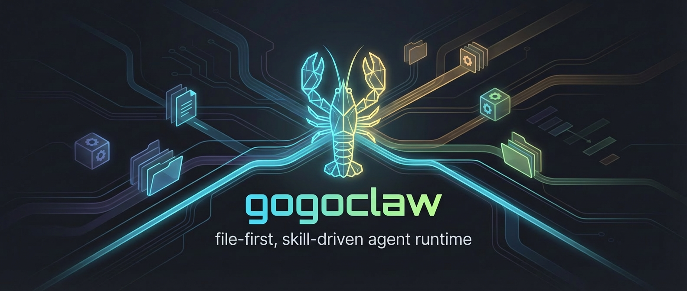

<p align="center">
  
</p>

<h1 align="center">gogoclaw</h1>

<p align="center">file-first, skill-driven agent runtime</p>

gogoclaw is a Go-based agent runtime for building file-first, skill-driven AI workflows.

It started from a coding-agent runtime shape inspired by OpenClaw and similar systems, but the project direction is now broader: keep the ReAct loop simple, use Tools + Skills + system prompt composition as the main extension surface, and let durable state live in the workspace as files.

The long-term goal is not a monolithic AI app, but a runtime spine that can support:

- foreground agents for user-facing conversation
- background agents for autonomous task execution
- cron-driven agents that poll, inspect, and continue file-based workflows
- shared skill layers across multiple agent profiles

## Positioning

gogoclaw currently sits in the middle ground between a chat agent shell and an agent operating system.

What it is today:

- a modular ReAct agent runtime with tool-calling
- a workspace-scoped system for prompts, skills, sessions, and runtime files
- a channel-aware gateway that can run in CLI or long-lived service mode
- a file-friendly foundation for future delegated and background agent workflows

What it is becoming:

- a profile-aware multi-agent runtime
- a foreground/background execution model where the loop stays the same and only output routing changes
- a skill-first system where most task workflows are expressed through files, skills, and scripts rather than hardcoded orchestration logic

## Design Principles

- Keep the ReAct loop stable. The core agent loop should remain small and predictable.
- Extend through Tools + Skills + system prompt composition. New workflows should usually land there first.
- Prefer files as durable state. Sessions, prompts, skills, cron tasks, artifacts, and future task boards should remain inspectable on disk.
- Keep runtime layers explicit. Provider, gateway, tools, sessions, channels, memory, and prompt assembly should stay separable.
- Let system abstractions stay minimal. Profile-aware invocation, output routing, and shared skill resolution belong in the runtime; task workflows belong in skills and scripts.

## Status

This repository is still pre-release and source-first.

Implemented today:

- Cobra-based CLI entrypoints for onboarding, auth, agent, gateway, MCP inspection, and version output
- onboarding flow that creates config, workspace bootstrap files, and default skills
- OpenAI-compatible chat provider abstraction plus Codex auth flow
- ReAct-style agent loop with tool-calling and bounded tool iterations
- workspace-backed session persistence with archive/reset behavior
- gateway runtime for direct CLI execution and long-running channel processing
- built-in CLI channel and optional Feishu channel integration
- cron service with workspace-backed cron task storage and execution
- memory service and recall tool integration when embedding is configured
- MCP service bootstrap and tool registration

Still evolving:

- agent profile selection across all execution paths
- agent-to-agent invocation and background execution
- foreground/background output sink abstraction
- shared skill visibility and layered skill resolution
- task-board style autonomous workflows built on top of skills and files

## Why This Project

Many agent systems become hard to extend because prompting, tools, transport, memory, orchestration, and state persistence are all mixed together.

gogoclaw keeps these layers explicit:

- agent: runs the ReAct loop and model/tool interaction
- provider: wraps chat and embedding backends
- tools: exposes model-callable capabilities
- session: persists conversation state to workspace files
- channels: handles foreground delivery through CLI or external transports
- cron: schedules autonomous prompts and task polling
- memory: extracts, stores, and recalls durable memory
- systemprompt and skills: assemble the runtime behavior from files in the workspace
- gateway: coordinates message flow and runtime lifecycle

That separation is the main reason the codebase can evolve from a direct chat runtime into a multi-agent, file-oriented system without replacing the core loop.

## Features

Current runtime features:

- interactive and non-interactive onboarding
- default workspace bootstrap with AGENTS.md, SOUL.md, TOOLS.md, USER.md, HEARTBEAT.md, and bundled default skills
- workspace-local skill discovery from skills/<skill-name>/SKILL.md
- OpenAI-compatible provider abstraction
- built-in provider presets for openrouter and codex
- Codex OAuth login flow via local callback server
- direct CLI execution through the gateway and message bus
- persistent sessions stored as JSON files inside the workspace
- session archive/reset flow via /new
- CLI progress output and tool-call visibility
- optional Feishu channel integration with richer outbound rendering
- cron task creation and cron-backed autonomous execution
- optional memory recall over workspace-backed vector storage
- MCP server management and MCP tool registration

Planned architecture features:

- profile-aware agent invocation
- invoke_agent style delegation tool
- foreground/background output sink separation
- shared skills with visibility metadata
- cron-first autonomous agents and board-driven task workflows built through skills and files

## Project Layout

```text
.
├── cmd/                    # CLI entrypoints
├── docs/                   # project documentation
├── internal/agent/         # ReAct loop and tool-call orchestration
├── internal/bootstrap/     # runtime wiring from config to gateway
├── internal/channels/      # CLI and Feishu channels
├── internal/cli/           # onboarding and auth flows
├── internal/config/        # config schema and loading
├── internal/cron/          # cron scheduler and workspace cron storage
├── internal/gateway/       # message routing and runtime lifecycle
├── internal/mcp/           # MCP service integration
├── internal/memory/        # memory extraction, storage, and recall
├── internal/message_bus/   # inbound/outbound queues
├── internal/provider/      # chat and embedding providers
├── internal/session/       # workspace-backed session persistence
├── internal/skills/        # workspace skill discovery
├── internal/systemprompt/  # prompt assembly from workspace files
├── internal/tools/         # built-in model tools
├── internal/vectorstore/   # sqlite-vec backed storage
└── internal/workspace/     # embedded workspace bootstrap templates
```

## Requirements

- Go 1.26.1 or newer
- cgo enabled for sqlite-vec support
- an OpenAI-compatible chat model endpoint or Codex-compatible authentication flow

## Installation

Build from source:

```bash
git clone https://github.com/Neneka448/gogoclaw.git
cd gogoclaw
CGO_ENABLED=1 go build -o gogoclaw .
```

Or use the provided Make target:

```bash
CGO_ENABLED=1 make build
```

If you hit build errors related to sqlite or cgo, see [docs/troubleshooting.md](docs/troubleshooting.md).

Install the sqlite-vec loadable extension into the default workspace location:

```bash
make sqlite-vec-install
```

Install it into a custom workspace:

```bash
make sqlite-vec-install WORKSPACE=/path/to/workspace
```

## Troubleshooting

- [docs/troubleshooting.md](docs/troubleshooting.md): build issues, including sqlite-vec and cgo-related failures

## Quick Start

### 1. Create a profile and workspace

Interactive onboarding:

```bash
./gogoclaw onboard --interactive
```

Non-interactive onboarding example:

```bash
./gogoclaw onboard \
	--provider openrouter \
	--model openai/gpt-4.1-mini \
	--apikey "$OPENROUTER_API_KEY"
```

By default this creates:

- profile directory at ~/.gogoclaw
- config file at ~/.gogoclaw/config.json
- workspace at ~/.gogoclaw/workspace
- sqlite-vec extension files under ~/.gogoclaw/workspace/sqlite-vec after make sqlite-vec-install

### 2. Run a one-shot agent command

```bash
./gogoclaw agent --message "Summarize the current repository structure"
```

The runtime will bootstrap the configured profile, load workspace prompts and skills, execute the ReAct loop, and emit responses through the channel/message-bus path.

### 3. Start the gateway

```bash
./gogoclaw gateway
```

This starts enabled channels and keeps the runtime alive for long-running processing. The CLI channel is enabled by default, and Feishu can be enabled in config.

### 4. Authenticate Codex if needed

```bash
./gogoclaw auth --provider codex
```

This opens a browser-based OAuth flow and stores the token locally for later reuse.

### 5. Inspect MCP servers

```bash
./gogoclaw mcp list
./gogoclaw mcp restart --name filesystem
```

## CLI Commands

Current user-facing commands:

- onboard: initialize config and workspace files
- auth: authenticate an OAuth-backed provider, currently Codex
- agent: send a direct message through the agent runtime
- gateway: start the long-running channel gateway
- mcp list: show configured MCP servers and their current status
- mcp restart --name <server>: reconnect one configured MCP server in a one-shot diagnostic run
- version: print build metadata

Global flags:

- --config, -c: override the default config path

## Configuration

The default config file is JSON-based and lives at ~/.gogoclaw/config.json.

Example:

```json
{
  "agents": {
    "profiles": {
      "default": {
        "workspace": "/Users/you/.gogoclaw/workspace",
        "provider": "openrouter",
        "model": "openai/gpt-4.1-mini",
        "maxTokens": 8192,
        "temperature": 0.1,
        "maxToolIterations": 40,
        "memoryWindow": 30,
        "maxRetryTimes": 3
      }
    }
  },
  "embedding": {
    "profiles": {
      "default": {
        "text": {
          "provider": "voyageai",
          "model": "voyage-4-large",
          "outputDimension": 1024
        },
        "modal": {
          "provider": "voyageai",
          "model": "voyage-multimodal-3.5",
          "outputDimension": 1024
        }
      }
    },
    "providers": [
      {
        "name": "voyageai",
        "timeout": 60,
        "baseURL": "",
        "path": "",
        "auth": {
          "token": "<voyage-api-key>"
        }
      }
    ]
  },
  "providers": [
    {
      "name": "openrouter",
      "timeout": 60,
      "baseURL": "",
      "path": "",
      "auth": {
        "token": "<token>"
      }
    }
  ],
  "channels": {
    "cli": {
      "enabled": true
    },
    "feishu": {
      "enabled": false,
      "appId": "",
      "appSecret": "",
      "encryptKey": "",
      "verificationToken": "",
      "allowFrom": ["*"],
      "reactEmoji": "THUMBSUP"
    },
    "sendProgress": true,
    "sendToolHints": true
  },
  "gateway": {
    "port": 8080,
    "host": "127.0.0.1",
    "heartbeat": {
      "interval": 1800,
      "enable": true
    }
  },
  "mcp": {
    "mcpServers": {
      "filesystem": {
        "enabled": true,
        "command": "npx",
        "args": [
          "-y",
          "@modelcontextprotocol/server-filesystem",
          "/Users/you/.gogoclaw/workspace"
        ],
        "env": {
          "NODE_NO_WARNINGS": "1"
        },
        "cwd": "/Users/you/.gogoclaw/workspace"
      }
    }
  },
  "tools": []
}
```

Notes:

- profile definitions already live under agents.profiles
- today, most runtime paths still effectively center on the default profile
- embedding models are configured separately under the embedding section
- terminal tool timeout can be configured through the tools array
- MCP servers are configured under mcp.mcpServers and support stdio plus Streamable HTTP
- if no custom workspace is provided during onboarding, it defaults to <profile-dir>/workspace

## Workspace Conventions

Onboarding bootstraps a workspace with several prompt and instruction files:

- AGENTS.md: high-level agent instructions
- SOUL.md: persona and values
- TOOLS.md: tool usage notes
- USER.md: durable user preferences
- HEARTBEAT.md: reserved workspace state file

Additional runtime conventions:

- skills are loaded from skills/<name>/SKILL.md
- default bundled skills are deployed into the workspace if missing
- sessions are persisted under sessions/<session-id>.json
- archived sessions are written when the user sends /new
- cron tasks are stored under crons/<cron-id>/
- vector and memory data live under the workspace as runtime files

## Built-in Tools

The runtime currently registers these built-in tools:

- read_file: read files from inside the workspace with line ranges
- list_dir: list directory contents inside the workspace
- terminal: run non-interactive shell commands inside the workspace
- message: actively send a message back through the channel layer
- get_skill: load a workspace skill by name
- create_cron: create or update workspace cron tasks
- recall_memory: query stored memory when memory is enabled

Additional MCP-backed tools may also be registered from configured MCP servers.

Workspace file and terminal tools are workspace-scoped to prevent escaping the configured workspace root.

## How It Works

At a high level, the runtime bootstraps like this:

1. Load config and resolve the active profile.
2. Build provider, tool registry, session manager, channel registry, memory, MCP, and system prompt services.
3. Load workspace skills and prompt fragments.
4. Register built-in and MCP tools.
5. Route inbound messages through the gateway or direct CLI path.
6. Run the ReAct loop until the model finishes or hits the tool iteration limit.
7. Persist session and runtime state back into the workspace.

In the current architecture, the ReAct loop is the stable execution core. Near-term system work is focused on adding profile-aware invocation and output routing around that core rather than replacing it.

## Roadmap

Near-term roadmap:

- profile-aware agent invocation as a first-class runtime abstraction
- invoke_agent style delegation tool for agent-to-agent launch
- cron support for target profile and invocation mode
- foreground/background output sink separation
- shared skills resolution with visibility metadata

Workflow roadmap on top of that foundation:

- file-first background task execution via skills and scripts
- task-board style workflows driven by cron and local files
- richer group-chat delegation and task coordination
- stronger multimodal and structured channel responses

The intention is to keep system abstractions small and let most domain workflows be expressed through workspace files, skills, and scripts.

## Development

Run tests:

```bash
go test ./...
```

Build with version metadata:

```bash
make build
```

Fast local development:

```bash
make test
```

The repository already includes tests for core areas such as bootstrap, channels, config, cron, gateway, memory, provider normalization, sessions, skills, tools, vectorstore, and workspace bootstrap files.

## Contributing

Before contributing, read [AGENTS.md](AGENTS.md).

This repository expects changes to stay focused, tested, and aligned with the existing layer boundaries.

Commit messages should follow the convention documented in AGENTS.md:

- use predicate(scope): summary
- keep the summary imperative, lowercase, and concise
- prefer scopes that match the primary directory or layer being changed

If your change affects behavior, add or update the relevant tests before submitting it.
